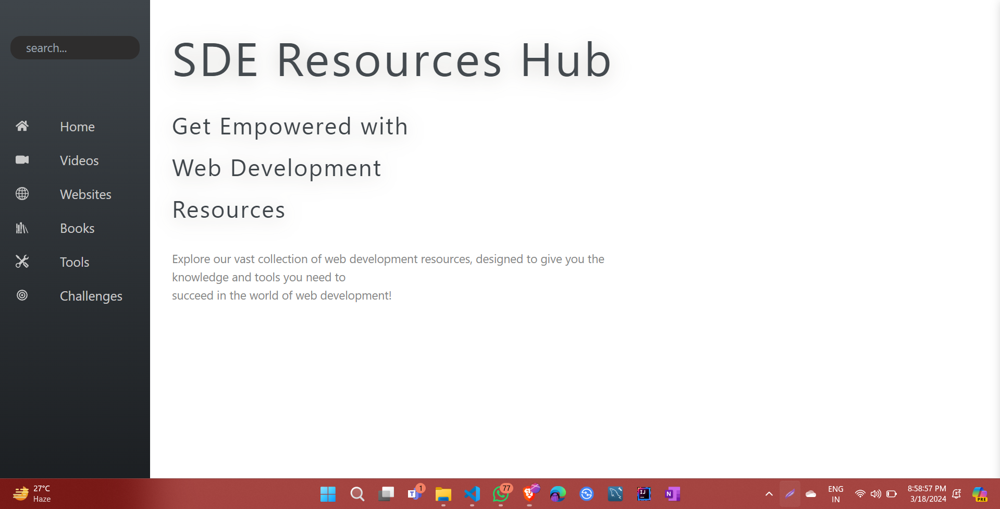

<h1 align="center">SDE Resource Hub 👨‍💻</h1>

   
 

## 🚀 About 

+ It serves as a comprehensive collection of **frontend SDE resources, including HTML, CSS, JavaScript, and React.** 
+ The project aims to provide developers with a **centralized platform** to access a wide range of frontend tools and resources, making their development process more efficient and productive.

## Deployed Links

### DEMO ->  https://sde-resources-hub.vercel.app/

## 📷 Screenshot 

## 🛠️ Tech Stack
     

<h1 align=center> Project Admins </h1>

<table>
        <tr>
            <td align="center"><a href="https://github.com/gautamkumar1"> <b> Gautam Kumar
                        </b></a> </td> </a></td>

</table>

</table>

 

